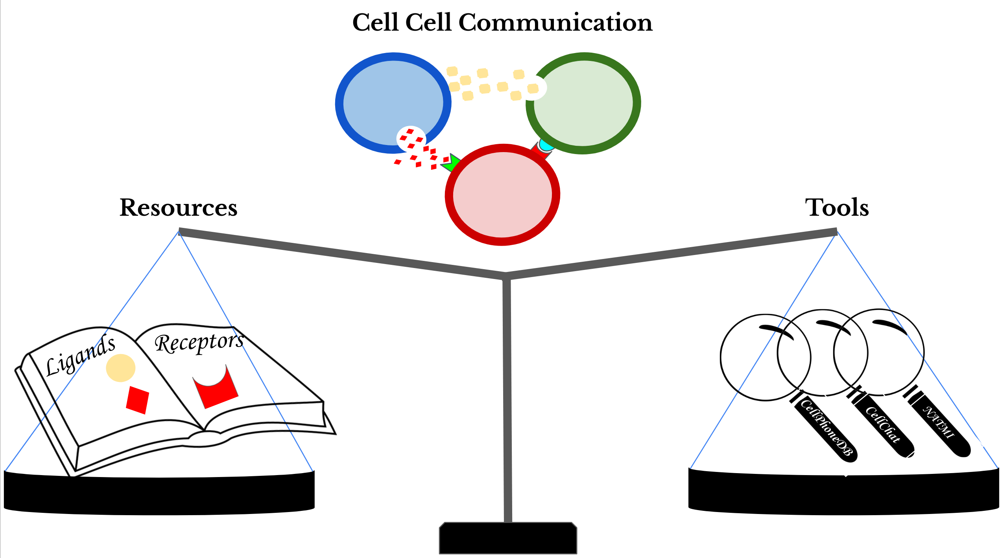

# Systematic Comparison of Cell-Cell Communication Tools and Resources

  
  
## Objectives
  
The continuous developments of single-cell RNA-Seq (scRNA-Seq) have sparked
an immense interest in understanding intercellular crosstalk. Multiple
tools and resources that aid the investigation of cell-cell communication (CCC)
were published recently.
However, these tools and resources are usually in a fixed combination of a
tool and its corresponding resource, but in principle any resource could be
combined with any tool. Yet, it is largely unclear the
difference that the choice of resource and tool can have on the predicted
CCC events. Thus, we attempt to shed some light on this topic via the
systematic comparison of how different combinations might influence CCC
inference.


## Pipeline
  
To this end we built a benchmark pipeline to decouple the tools from their corresponding resources.
In turn, we used the pipeline for the systematic comparison of all combinations between 15 resources and 6 tools.
  
The pipeline is open access and available in this repository.
  

  
  

## Tools

The tools implemented in this repository are:

- CellPhoneDB algorithm (via Squidpy)
- CellChat
- NATMI
- Connectome
- SingleCellSignalR (SCAomni)
- iTALK
  
  
  
## Resources

### Ligand-receptor resources

The following intercellular signalling (ligand-receptor interaction)
resources are accessible by this package:

- CellChatDB
- CellPhoneDB
- Ramilowski2015
- Baccin2019
- LRdb
- Kiroauc2010
- ICELLNET
- iTALK
- EMBRACE
- HPMR
- Guide2Pharma
- connectomeDB2020
- talklr
- CellTalkDB
- OmniPath
  
  
### OmniPath
  
All the resources above are retrieved from OmniPath (https://omnipathdb.org/).
OmniPath itself is also a composite resource combining all the ones listed
above. However the cell-cell interactions in OmniPath are more than simply
the union of the ligand-receptor resources. OmniPath uses several further
databases to collect information about the roles of proteins in intercellular
communication and again other databases to find connections between them. At
the same time, OmniPath blacklists certain wrong annotations, removing some
of the contents of the original resources. However the data of individual
resources retrieved from the OmniPath web service is not affected by this,
each resource supposed to be identical to its original form, apart from minor
processing imperfections. OmniPath as a composite resource we use in four
varieties: the full OmniPath intercellular network, only ligand-receptor
interactions, quality filtered (50 percentile consensus score cut off), and
ligand-receptor only quality filtered.
  
  
### Random and default
  
Moreover, a Randomized resource can be generated via reshuffling any of the
abovementioned using the `BiRewire` package, and each tool can be run with
its 'Default' resource, the dataset used in its original publication.
  
  
  
## Dependancies
Please check the [.yml](https://github.com/saezlab/Cell_Cell_Investigation/blob/biorxiv/intercell.yml) file
(Recommended to use it to set up a conda environment) and then also install the following in R:
   
   
```{r}
library(devtools)  
Sys.setenv(R_REMOTES_NO_ERRORS_FROM_WARNINGS = TRUE) # iTALK throws a warning...   
devtools::install_github("sqjin/CellChat")  
devtools::install_github('msraredon/Connectome', ref = 'master')   
devtools::install_github('Coolgenome/iTALK', ref = 'biorxiv')   
# A modified version of SingleCellSignalR (SCA) that enables external resources
devtools::install_github(repo = "https://github.com/CostaLab/SingleCellSignalR_v1", subdir = "SingleCellSignalR")
# Install this repos
devtools::install_github('saezlab/Cell_Cell_Investigation', ref = 'biorxiv')  
```
  
  
#### Clone NATMI, as it is run via the command line 
```{sh}
git clone https://github.com/asrhou/NATMI.git
```
  
  
## References
Baccin, C., Al-Sabah, J., Velten, L., Helbling, P.M., Grünschläger, F., Hernández-Malmierca, P., Nombela-Arrieta, C., Steinmetz, L.M., Trumpp, A., and Haas, S. (2020). Combined single-cell and spatial transcriptomics reveal the molecular, cellular and spatial bone marrow niche organization. Nat. Cell Biol. 22, 38–48.

Ben-Shlomo, I., Yu Hsu, S., Rauch, R., Kowalski, H.W., and Hsueh, A.J.W. (2003). Signaling receptome: a genomic and evolutionary perspective of plasma membrane receptors involved in signal transduction. Sci. STKE 2003, RE9.

Cabello-Aguilar, S., Alame, M., Kon-Sun-Tack, F., Fau, C., Lacroix, M., and Colinge, J. (2020). SingleCellSignalR: inference of intercellular networks from single-cell transcriptomics. Nucleic Acids Res. 48, e55.

Efremova, M., Vento-Tormo, M., Teichmann, S.A., and Vento-Tormo, R. (2020). CellPhoneDB: inferring cell-cell communication from combined expression of multi-subunit ligand-receptor complexes. Nat. Protoc. 15, 1484–1506.

Harding, S.D., Sharman, J.L., Faccenda, E., Southan, C., Pawson, A.J., Ireland, S., Gray, A.J.G., Bruce, L., Alexander, S.P.H., Anderton, S., et al. (2018). The IUPHAR/BPS Guide to PHARMACOLOGY in 2018: updates and expansion to encompass the new guide to IMMUNOPHARMACOLOGY. Nucleic Acids Res. 46, D1091–D1106.

Hou, R., Denisenko, E., Ong, H.T., Ramilowski, J.A., and Forrest, A.R.R. (2020). Predicting cell-to-cell communication networks using NATMI. Nat. Commun. 11, 5011.

Jin, S., Guerrero-Juarez, C.F., Zhang, L., Chang, I., Ramos, R., Kuan, C.-H., Myung, P., Plikus, M.V., and Nie, Q. (2021). Inference and analysis of cell-cell communication using CellChat. Nat. Commun. 12, 1088.


Noël, F., Massenet-Regad, L., Carmi-Levy, I., Cappuccio, A., Grandclaudon, M., Trichot, C., Kieffer, Y., Mechta-Grigoriou, F., and Soumelis, V. (2021). Dissection of intercellular communication using the transcriptome-based framework ICELLNET. Nat. Commun. 12, 1089.

Palla, G., Spitzer, H., Klein, M., Fischer, D.S., Schaar, A.C., Kuemmerle, L.B., Rybakov, S., Ibarra, I.L., Holmberg, O., Virshup, I., et al. (2021). Squidpy: a scalable framework for spatial single cell analysis. BioRxiv.

Ramilowski, J.A., Goldberg, T., Harshbarger, J., Kloppmann, E., Lizio, M., Satagopam, V.P., Itoh, M., Kawaji, H., Carninci, P., Rost, B., et al. (2015). A draft network of ligand-receptor-mediated multicellular signalling in human. Nat. Commun. 6, 7866.

Raredon, M.S.B., Yang, J., Garritano, J., Wang, M., Kushnir, D., Schupp, J.C., Adams, T.S., Greaney, A.M., Leiby, K.L., Kaminski, N., et al. (2021). Connectome: computation and visualization of cell-cell signaling topologies in single-cell systems data. BioRxiv.

Shao, X., Liao, J., Li, C., Lu, X., Cheng, J., and Fan, X. (2020). CellTalkDB: a manually curated database of ligand-receptor interactions in humans and mice. Brief. Bioinformatics.

Sheikh, B.N., Bondareva, O., Guhathakurta, S., Tsang, T.H., Sikora, K., Aizarani, N., Sagar, Holz, H., Grün, D., Hein, L., et al. (2019). Systematic Identification of Cell-Cell Communication Networks in the Developing Brain. IScience 21, 273–287.

Türei, D., Valdeolivas, A., Gul, L., Palacio-Escat, N., Klein, M., Ivanova, O., Ölbei, M., Gábor, A., Theis, F., Módos, D., et al. (2021). Integrated intra- and intercellular signaling knowledge for multicellular omics analysis. Mol. Syst. Biol. 17, e9923.

Vento-Tormo, R., Efremova, M., Botting, R.A., Turco, M.Y., Vento-Tormo, M., Meyer, K.B., Park, J.-E., Stephenson, E., Polański, K., Goncalves, A., et al. (2018). Single-cell reconstruction of the early maternal-fetal interface in humans. Nature 563, 347–353.

Wang, Y. (2020). talklr uncovers ligand-receptor mediated intercellular crosstalk. BioRxiv.

Wang, Y., Wang, R., Zhang, S., Song, S., Jiang, C., Han, G., Wang, M., Ajani, J., Futreal, A., and Wang, L. (2019). iTALK: an R Package to Characterize and Illustrate Intercellular Communication. BioRxiv.


  
### R sessionInfo()
R version 4.0.3 (2020-10-10)  
Platform: x86_64-pc-linux-gnu (64-bit)  
Running under: Ubuntu 20.04.2 LTS  
  
Matrix products: default  
BLAS:   /usr/lib/x86_64-linux-gnu/blas/libblas.so.3.9.0  
LAPACK: /usr/lib/x86_64-linux-gnu/lapack/liblapack.so.3.9.0  
  
locale:  
 [1] LC_CTYPE=en_US.UTF-8       LC_NUMERIC=C               LC_TIME=de_DE.UTF-8        LC_COLLATE=en_US.UTF-8     LC_MONETARY=de_DE.UTF-8   
 [6] LC_MESSAGES=en_US.UTF-8    LC_PAPER=de_DE.UTF-8       LC_NAME=C                  LC_ADDRESS=C               LC_TELEPHONE=C            
[11] LC_MEASUREMENT=de_DE.UTF-8 LC_IDENTIFICATION=C       

attached base packages:  
[1] parallel  stats     graphics  grDevices utils     datasets  methods   base     

other attached packages:  
 [1] intercell_0.0.1     ggfortify_0.4.11    RColorBrewer_1.1-2  UpSetR_1.4.0        magrittr_2.0.1      yardstick_0.0.7     BiRewire_3.22.0    
 [8] Matrix_1.2-18       tsne_0.1-3          slam_0.1-48         reticulate_1.18     rprojroot_2.0.2     SCAomni_0.0.1.8     Seurat_3.2.3       
[15] iTALK_0.1.0         CellChat_0.5.5      Connectome_1.0.1    OmnipathR_2.0.0     jsonlite_1.7.2      igraph_1.2.6        forcats_0.5.1      
[22] stringr_1.4.0       dplyr_1.0.4         purrr_0.3.4         readr_1.4.0         tidyr_1.1.2         tibble_3.0.6        ggplot2_3.3.3      
[29] tidyverse_1.3.0     Biobase_2.50.0      BiocGenerics_0.36.0

loaded via a namespace (and not attached):  
  [1] statnet.common_4.4.1        rsvd_1.0.3                  ica_1.0-2                   svglite_2.0.0               ps_1.5.0                   
  [6] foreach_1.5.1               lmtest_0.9-38               crayon_1.4.1                V8_3.4.0                    MASS_7.3-53                
 [11] MAST_1.16.0                 nlme_3.1-149                backports_1.2.1             qlcMatrix_0.9.7             reprex_1.0.0               
 [16] rlang_0.4.10                XVector_0.30.0              ROCR_1.0-11                 readxl_1.3.1                irlba_2.3.3                
 [21] SparseM_1.81                callr_3.5.1                 limma_3.46.0                BiocParallel_1.24.1         rjson_0.2.20               
 [26] bit64_4.0.5                 glue_1.4.2                  pheatmap_1.0.12             rngtools_1.5                sctransform_0.3.2          
 [31] processx_3.4.5              AnnotationDbi_1.52.0        VGAM_1.1-5                  haven_2.3.1                 tidyselect_1.1.0           
 [36] SummarizedExperiment_1.20.0 usethis_2.0.1               fitdistrplus_1.1-3          XML_3.99-0.5                DEsingle_1.10.0            
 [41] zoo_1.8-8                   gg.gap_1.3                  xtable_1.8-4                MatrixModels_0.4-1          cli_2.3.0                  
 [46] zlibbioc_1.36.0             rstudioapi_0.13             miniUI_0.1.1.1              rpart_4.1-15                shiny_1.6.0                
 [51] clue_0.3-58                 multtest_2.46.0             pkgbuild_1.2.0              cluster_2.1.0               caTools_1.18.1             
 [56] pcaMethods_1.82.0           quantreg_5.83               ggrepel_0.9.1               listenv_0.8.0               png_0.1-7                  
 [61] future_1.21.0               withr_2.4.1                 rle_0.9.2                   bitops_1.0-6                plyr_1.8.6                 
 [66] cellranger_1.1.0            sparsesvd_0.2               pROC_1.17.0.1               pracma_2.3.3                coda_0.19-4                
 [71] pillar_1.4.7                gplots_3.1.1                GlobalOptions_0.1.2         cachem_1.0.4                pscl_1.5.5                 
 [76] fs_1.5.0                    flexmix_2.3-17              GetoptLong_1.0.5            gamlss.data_5.1-4           vctrs_0.3.6                
 [81] ellipsis_0.3.1              generics_0.1.0              randomcoloR_1.1.0.1         devtools_2.3.2              NMF_0.23.0                 
 [86] tools_4.0.3                 munsell_0.5.0               distillery_1.2              DelayedArray_0.16.1         fastmap_1.1.0              
 [91] compiler_4.0.3              HSMMSingleCell_1.10.0       pkgload_1.1.0               abind_1.4-5                 httpuv_1.5.5               
 [96] extRemes_2.1                sessioninfo_1.1.1           pkgmaker_0.32.2             plotly_4.9.3                GenomeInfoDbData_1.2.4     
[101] gridExtra_2.3               edgeR_3.32.1                lattice_0.20-41             deldir_0.2-10               later_1.1.0.1              
[106] scales_1.1.1                docopt_0.7.1                pbapply_1.4-3               genefilter_1.72.1           lazyeval_0.2.2             
[111] promises_1.2.0.1            spatstat_1.64-1             doParallel_1.0.16           goftest_1.2-2               spatstat.utils_2.1-0       
[116] brew_1.0-6                  sna_2.6                     sandwich_3.0-0              cowplot_1.1.1               Rtsne_0.15                 
[121] uwot_0.1.10                 Rook_1.1-1                  survival_3.2-7              numDeriv_2016.8-1.1         systemfonts_1.0.1          
[126] DDRTree_0.1.5               htmltools_0.5.1.1           memoise_2.0.0               modeltools_0.2-23           locfit_1.5-9.4             
[131] IRanges_2.24.1              viridisLite_0.3.0           digest_0.6.27               assertthat_0.2.1            mime_0.10                  
[136] densityClust_0.3            registry_0.5-1              SIMLR_1.16.0                RSQLite_2.2.3               future.apply_1.7.0         
[141] remotes_2.2.0               RcppArmadillo_0.10.2.1.0    data.table_1.14.0           blob_1.2.1                  S4Vectors_0.28.1           
[146] fastICA_1.2-2               splines_4.0.3               Cairo_1.5-12.2              RCurl_1.98-1.2              broom_0.7.5                
[151] monocle_2.18.0              hms_1.0.0                   modelr_0.1.8                colorspace_2.0-0            GenomicRanges_1.42.0       
[156] shape_1.4.5                 maxLik_1.4-6                nnet_7.3-14                 Rcpp_1.0.6                  RANN_2.6.1                 
[161] mvtnorm_1.1-1               circlize_0.4.12             conquer_1.0.2               parallelly_1.23.0           R6_2.5.0                   
[166] grid_4.0.3                  ggridges_0.5.3              lifecycle_1.0.0             miscTools_0.6-26            curl_4.3                   
[171] leiden_0.3.7                testthat_3.0.2              desc_1.2.0                  scde_2.18.0                 RcppAnnoy_0.0.18           
[176] iterators_1.0.13            htmlwidgets_1.5.3           polyclip_1.10-0             RMTstat_0.3                 network_1.16.1             
[181] gamlss_5.2-0                rvest_0.3.6                 ComplexHeatmap_2.6.2        mgcv_1.8-33                 globals_0.14.0             
[186] patchwork_1.1.1             bdsmatrix_1.3-4             codetools_0.2-16            Lmoments_1.3-1              matrixStats_0.58.0         
[191] lubridate_1.7.9.2           FNN_1.1.3                   gtools_3.8.2                prettyunits_1.1.1           SingleCellExperiment_1.12.0
[196] dbplyr_2.1.0                gridBase_0.4-7              RSpectra_0.16-0             GenomeInfoDb_1.26.2         gtable_0.3.0               
[201] DBI_1.1.1                   ggalluvial_0.12.3           stats4_4.0.3                tensor_1.5                  httr_1.4.2                 
[206] KernSmooth_2.23-17          stringi_1.5.3               progress_1.2.2              reshape2_1.4.4              annotate_1.68.0            
[211] viridis_0.5.1               xml2_1.3.2                  combinat_0.0-8              bbmle_1.0.23.1              geneplotter_1.68.0         
[216] scattermore_0.7             DESeq2_1.30.1               bit_4.0.4                   MatrixGenerics_1.2.1        spatstat.data_2.1-0        
[221] pkgconfig_2.0.3             gamlss.dist_5.1-7  
