#### Background

This markdown contains the results presented in the comparative Analysis
of CCC predictions from different method-resource combinations using
publicly available [colorectal cancer
data](https://www.nature.com/articles/s41588-020-0636-z). Specifically,
we focused on the interactions between tumour cells subclassified by
their resemblance of CRC consensus molecular subtypes (CMS) and immune
cells from tumour samples.

#### Load Results from different Method-Resource Combinations

##### Note that the objects loaded here were already generated via the pipeline for each method

    # We only define the measures from each method that we wish to have in our analysis
    spec_list <- list("CellChat" =
                          methods::new("MethodSpecifics",
                                       method_name="CellChat",
                                       method_results = readRDS("output/crc_res/cellchat_results.rds"),
                                       method_scores=list(
                                           "prob"=TRUE
                                           )),
                      "Connectome" =
                          methods::new("MethodSpecifics",
                                       method_name="Connectome",
                                       method_results = readRDS("output/crc_res/conn_results.rds"),
                                       method_scores=list(
                                           "weight_sc"=TRUE
                                       )),
                      "iTALK" =
                          methods::new("MethodSpecifics",
                                       method_name="iTALK",
                                       method_results = readRDS("output/crc_res/italk_results.rds"),
                                       method_scores=list(
                                           "weight_comb"=TRUE
                                       )),
                      "NATMI" =
                          methods::new("MethodSpecifics",
                                       method_name="NATMI",
                                       method_results = readRDS("output/crc_res/natmi_results.rds"),
                                       method_scores=list(
                                           "edge_specificity"=TRUE
                                           )),
                      "SCA" = methods::new("MethodSpecifics",
                                           method_name="SCA",
                                           method_results = readRDS("output/crc_res/sca_results.rds"),
                                           method_scores=list(
                                               "LRscore"=TRUE
                                               )),
                      "Squidpy" =
                          methods::new("MethodSpecifics",
                                       method_name="Squidpy",
                                       method_results = readRDS("output/crc_res/squidpy_results.rds"),
                                       method_scores=list(
                                           "pvalue"=FALSE
                                       ))
                      )
    # Define the numbers of highest interactions that we wish to explore
    # and get a list with each threshold as its element
    top_lists <- get_top_hits(spec_list,
                              n_ints=c(100,
                                       250,
                                       500,
                                       1000)
                              )

### Main Text Plots

#### Combine all binary results into heatmap (top500)

Overlap in the 500 highest ranked CCC interactions between different
combinations of methods and resources. Method-resource combinations were
clustered according to binary (Jaccard index) distances. SCA refers to
the SingleCellSignalR method.

    get_BinaryHeat(top_lists$top_500)

    grid::grid.newpage()

#### Activity per Cell type

##### Inferred as the proportion of interaction edges that stem from Source Cell clusters or lead to Target Cell clusters in the highest ranked interactions.

    # Cap to 0.2 (due to high activity in SCA)
    get_activecell(top_lists$top_500, cap_value = 0.2)

    grid::grid.newpage()

#### Jaccard Index exploration

    # Similarity Heatmap (according to Jaccard index)
    get_simdist_heatmap(top_lists$top_500,
                             sim_dist = "simil",
                             method = "Jaccard",
                             diag = TRUE,
                             upper = TRUE)

    grid::grid.newpage()

    # Get Jaccard Stats
    jaccard_per_mr <- simdist_resmet(top_lists$top_500,
                                     sim_dist = "simil",
                                     method = "Jaccard")
    jac <- list_stats(meth = jaccard_per_mr$meth,
                      reso = jaccard_per_mr$reso)

    # Here we obtain the mean Jaccard index per resource when using different methods
    # and per method when using different resources
    jac

    ## # A tibble: 4 x 8
    ##   name      simdist         mn    med   len     sd   .min   .max
    ##   <glue>    <list>       <dbl>  <dbl> <int>  <dbl>  <dbl>  <dbl>
    ## 1 meth_comb <dbl [630]> 0.167  0.0953   630 0.195  0      1     
    ## 2 reso_comb <dbl [225]> 0.0243 0.0103   225 0.0380 0      0.212 
    ## 3 meth_mean <dbl [6]>   0.167  0.172      6 0.0374 0.113  0.203 
    ## 4 reso_mean <dbl [15]>  0.0243 0.0186    15 0.0161 0.0101 0.0598

    # pairwise JI between methods
    methods <- c("CellChat", "Connectome", "iTALK", "NATMI", "SCA", "Squidpy")
    methods_jacc <- methods %>%
        combn(2) %>%
        t() %>%
        as_tibble() %>%
        unite(c("V1", "V2"), col = "method_combo") %>%
        mutate(methods = str_split(method_combo, "_")) %>%
        mutate(jacc_mat = pmap(list(.x = method_combo,
                                    .y = methods),
                               .f = function(.x, .y){
                                   list(.x = get_jacc(top_lists$top_500,
                                                      .y,
                                                      as.character(get_lr_resources()))
                                        )
                                        }
                               )
               ) %>%
        unnest(jacc_mat) %>%
        rowwise() %>%
        mutate(jacc_mean = mean(jacc_mat)) %>%
        ungroup() %>%
        arrange(desc(jacc_mean))

    # pairwise similarity between each method combination
    # i.e. here we don't consider the universe of method-resource combinations
    # but rather just the comparison of any two methods when using each resource
    methods_jacc

    ## # A tibble: 15 x 4
    ##    method_combo        methods   jacc_mat          jacc_mean
    ##    <chr>               <list>    <named list>          <dbl>
    ##  1 Connectome_NATMI    <chr [2]> <simil [28 × 28]>    0.110 
    ##  2 NATMI_Squidpy       <chr [2]> <simil [28 × 28]>    0.0996
    ##  3 Connectome_iTALK    <chr [2]> <simil [28 × 28]>    0.0983
    ##  4 Connectome_Squidpy  <chr [2]> <simil [28 × 28]>    0.0965
    ##  5 CellChat_Connectome <chr [2]> <simil [28 × 28]>    0.0904
    ##  6 iTALK_NATMI         <chr [2]> <simil [28 × 28]>    0.0898
    ##  7 NATMI_SCA           <chr [2]> <simil [28 × 28]>    0.0876
    ##  8 Connectome_SCA      <chr [2]> <simil [28 × 28]>    0.0869
    ##  9 SCA_Squidpy         <chr [2]> <simil [28 × 28]>    0.0845
    ## 10 iTALK_Squidpy       <chr [2]> <simil [28 × 28]>    0.0834
    ## 11 CellChat_NATMI      <chr [2]> <simil [28 × 28]>    0.0798
    ## 12 CellChat_Squidpy    <chr [2]> <simil [28 × 28]>    0.0748
    ## 13 CellChat_iTALK      <chr [2]> <simil [28 × 28]>    0.0701
    ## 14 iTALK_SCA           <chr [2]> <simil [28 × 28]>    0.0694
    ## 15 CellChat_SCA        <chr [2]> <simil [28 × 28]>    0.0631

    # Jaccard Index using the Same Method with different resources
    #  (i.e. similarity among combinations using the same method)
    # or in other words how similar are the results from each method with different resources
    methods %>% map(function(met){
        get_jacc(top_lists$top_500,
                 met,
                 as.character(as.character(get_lr_resources()))) %>%
            mean()
    }) %>% setNames(methods)

    ## $CellChat
    ## [1] 0.1098182
    ## 
    ## $Connectome
    ## [1] 0.2060428
    ## 
    ## $iTALK
    ## [1] 0.1469834
    ## 
    ## $NATMI
    ## [1] 0.2187134
    ## 
    ## $SCA
    ## [1] 0.1377277
    ## 
    ## $Squidpy
    ## [1] 0.1947479

#### Check hits per method (whenever a threshold is proposed)

    # Check CellChat P-values
    cc_hits <- spec_list$CellChat@method_results %>%
        map(function(resource) resource %>%
                filter(pval <= 0.05))
    cc_hits %>% map(function(x) nrow(x)) %>% enframe(name="method", value="n_hits") %>% unnest(n_hits)

    ## # A tibble: 17 x 2
    ##    method           n_hits
    ##    <chr>             <int>
    ##  1 Reshuffled         5839
    ##  2 Default            3041
    ##  3 CellChatDB         2940
    ##  4 CellPhoneDB        2828
    ##  5 Ramilowski2015     4856
    ##  6 Baccin2019         2521
    ##  7 LRdb              10632
    ##  8 Kirouac2010         237
    ##  9 ICELLNET            577
    ## 10 iTALK              8608
    ## 11 EMBRACE            4402
    ## 12 HPMR                754
    ## 13 Guide2Pharma        488
    ## 14 connectomeDB2020   7077
    ## 15 talklr             7415
    ## 16 CellTalkDB        11395
    ## 17 OmniPath          12971

    # Check SCA above threshold
    sca_hits <- spec_list$SCA@method_results %>%
        map(function(resource) resource %>%
                filter(LRscore >= 0.5))
    sca_hits %>% map(function(x) nrow(x)) %>% enframe(name="method", value="n_hits") %>% unnest(n_hits)

    ## # A tibble: 17 x 2
    ##    method           n_hits
    ##    <chr>             <int>
    ##  1 Reshuffled         3702
    ##  2 Default            7211
    ##  3 CellChatDB         1590
    ##  4 CellPhoneDB        1761
    ##  5 Ramilowski2015     3107
    ##  6 Baccin2019         1500
    ##  7 LRdb               7240
    ##  8 Kirouac2010         159
    ##  9 ICELLNET            418
    ## 10 iTALK              5484
    ## 11 EMBRACE            2246
    ## 12 HPMR                371
    ## 13 Guide2Pharma        544
    ## 14 connectomeDB2020   3907
    ## 15 talklr             4332
    ## 16 CellTalkDB         7017
    ## 17 OmniPath           6813

    # Check Squidpy P-values
    sq_hits <- spec_list$Squidpy@method_results %>%
        map(function(resource) resource %>%
                filter(pvalue <= 0.05))
    sq_hits %>% map(function(x) nrow(x)) %>% enframe(name="method", value="n_hits") %>% unnest(n_hits)

    ## # A tibble: 16 x 2
    ##    method           n_hits
    ##    <chr>             <int>
    ##  1 Reshuffled         1405
    ##  2 CellChatDB          716
    ##  3 CellPhoneDB         613
    ##  4 Ramilowski2015     1330
    ##  5 Baccin2019          665
    ##  6 LRdb               2521
    ##  7 Kirouac2010          60
    ##  8 ICELLNET            185
    ##  9 iTALK              2046
    ## 10 EMBRACE            1221
    ## 11 HPMR                338
    ## 12 Guide2Pharma        156
    ## 13 connectomeDB2020   1622
    ## 14 talklr             1813
    ## 15 CellTalkDB         2745
    ## 16 OmniPath           2927

### Supplementary Plots

#### Upset Plots by Method for highest ranked 500 interactions (CRC)

    names(top_lists$top_500) %>%
        map(function(m_name){
            top_lists$top_500[[m_name]] %>%
                prepForUpset() %>%
                plotSaveUset(figure_path_mr(as.character(str_glue("crc_{m_name}_top500_upset_method.png"))),
                             m_name)
            }
        )

    ## [[1]]

    ## 
    ## [[2]]

    ## 
    ## [[3]]

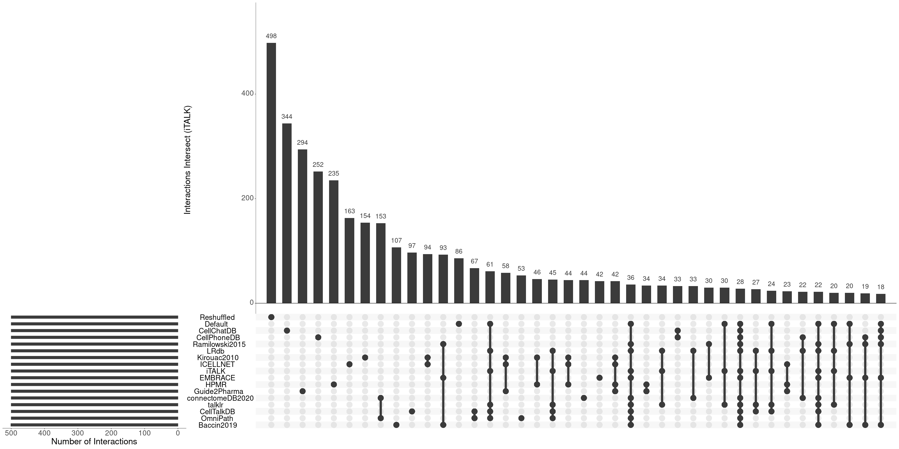

    ## 
    ## [[4]]

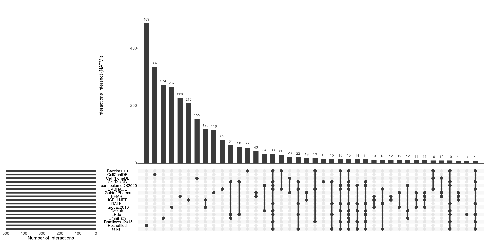

    ## 
    ## [[5]]

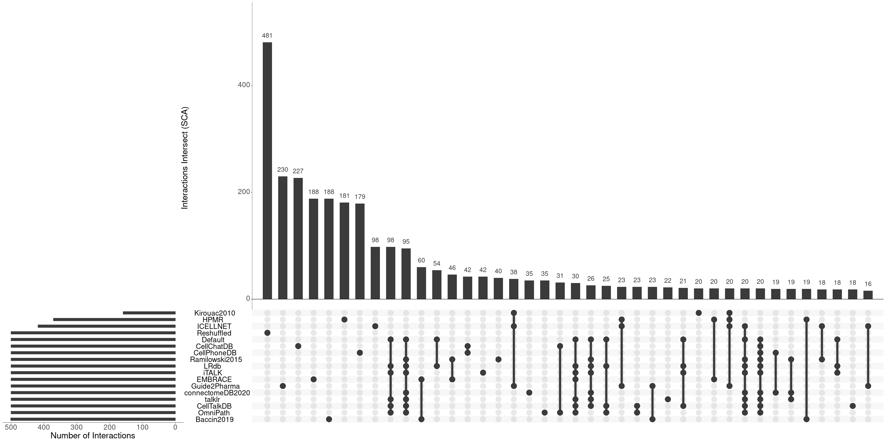

    ## 
    ## [[6]]

#### Upset Plots by Resource for highest ranked 500 interactions (CRC)

    top250_resource_tool <- get_swapped_list(top_lists$top_500)

    # Plot and Save Upsets
    names(top250_resource_tool) %>%
        map(function(r_name){
            top250_resource_tool[[r_name]] %>%
                prepForUpset() %>%
                plotSaveUset(figure_path_mr(as.character(str_glue("crc_{r_name}_top500_upset_resource.png"))),
                             r_name)
            }
        )

    ## [[1]]

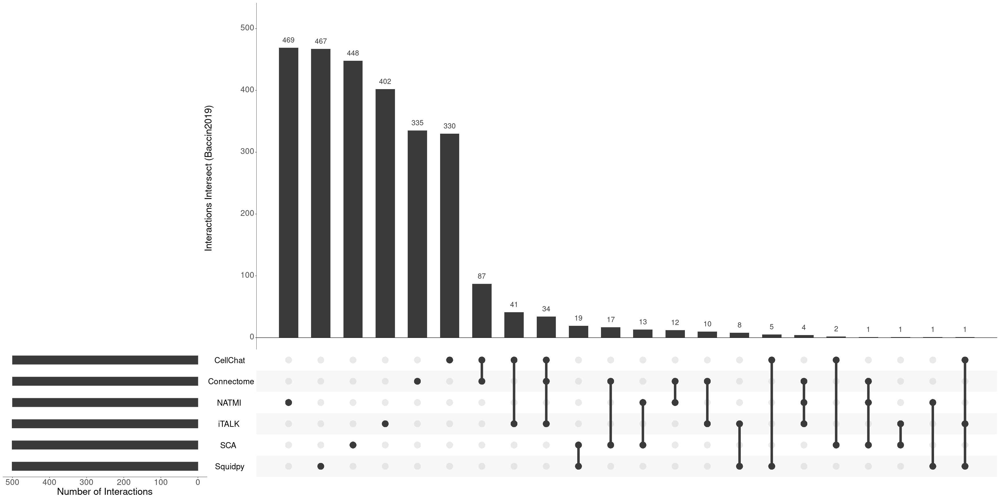

    ## 
    ## [[2]]

    ## 
    ## [[3]]

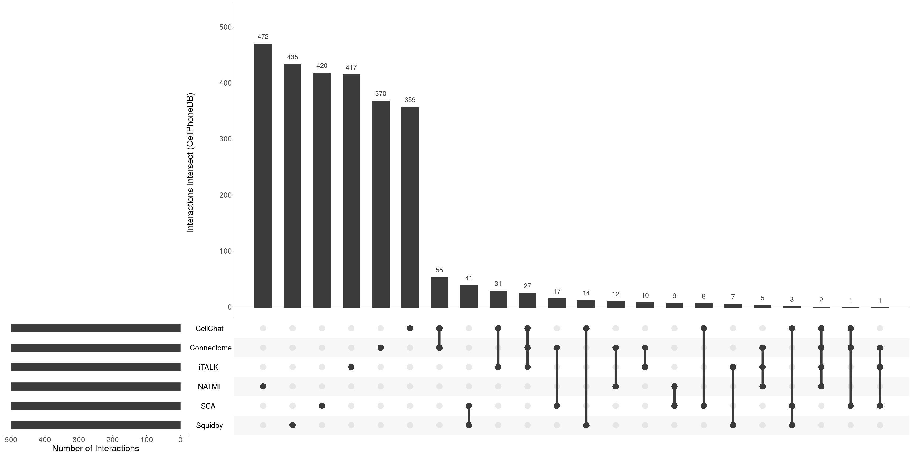

    ## 
    ## [[4]]

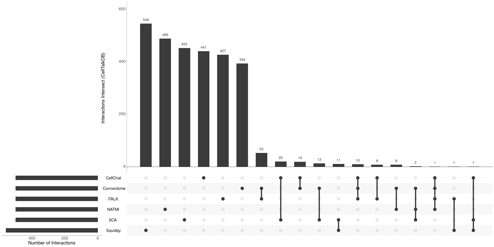

    ## 
    ## [[5]]

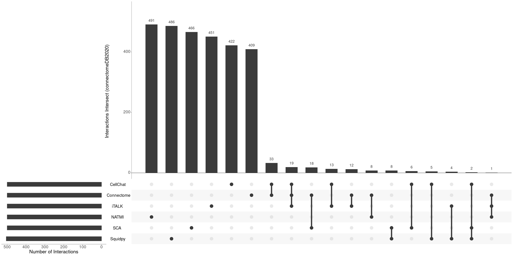

    ## 
    ## [[6]]

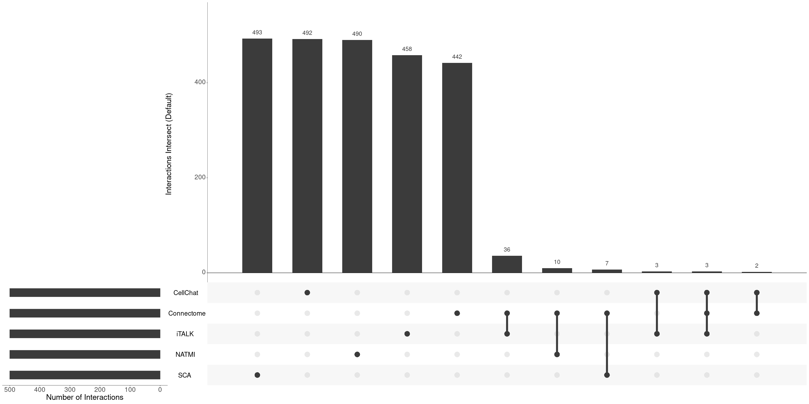

    ## 
    ## [[7]]

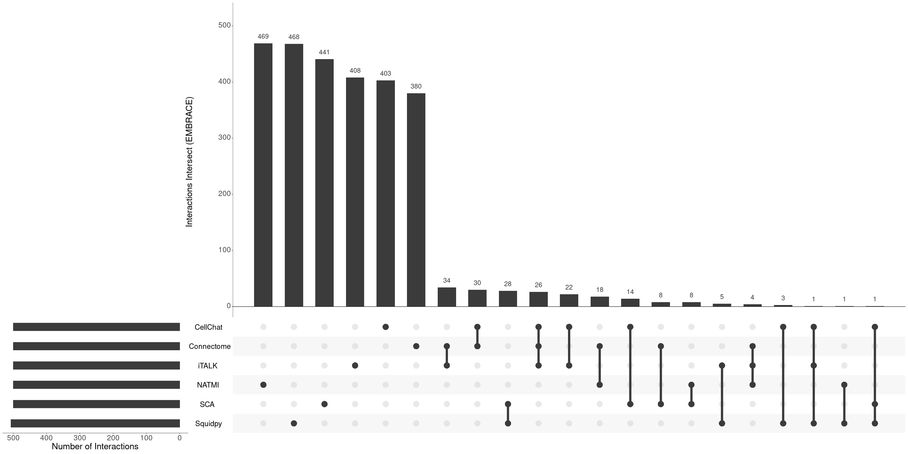

    ## 
    ## [[8]]

    ## 
    ## [[9]]

    ## 
    ## [[10]]

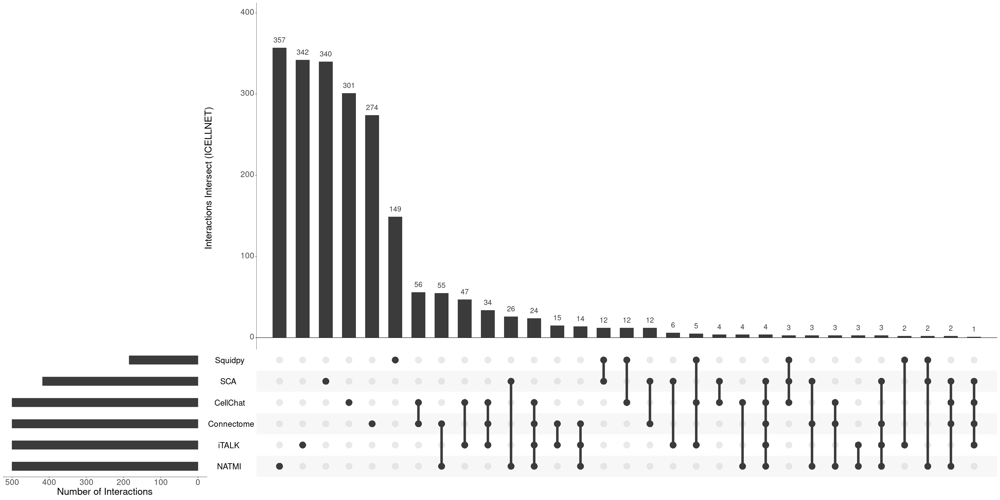

    ## 
    ## [[11]]

    ## 
    ## [[12]]

    ## 
    ## [[13]]

    ## 
    ## [[14]]

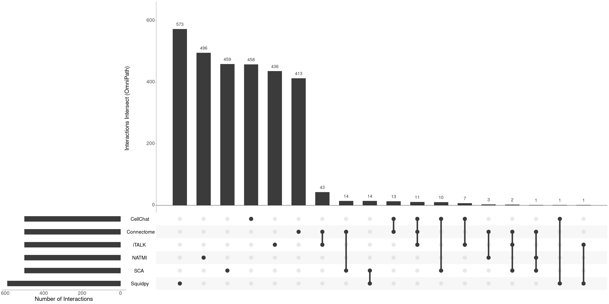

    ## 
    ## [[15]]

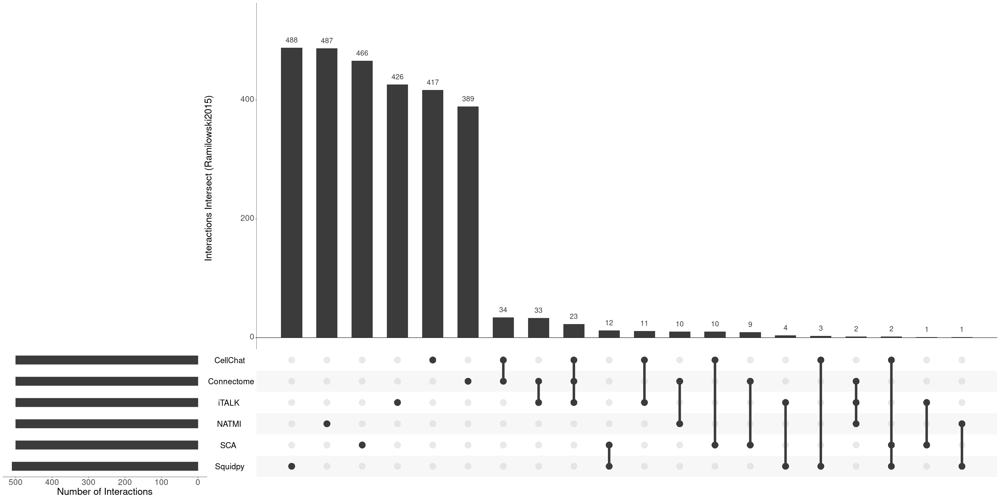

    ## 
    ## [[16]]

    ## 
    ## [[17]]

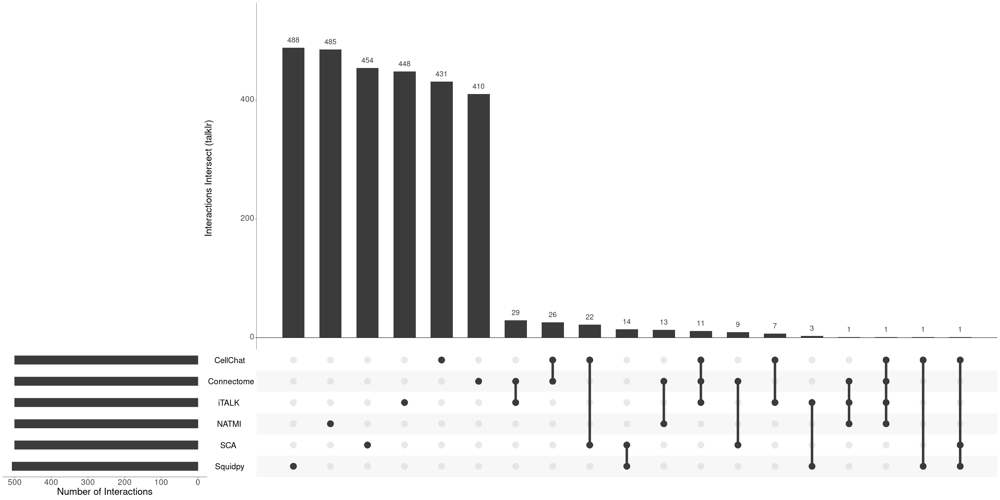

#### Binary heatmaps (Supp interactions: 100, 250, and 1000)

    get_BinaryHeat(top_lists$top_100)

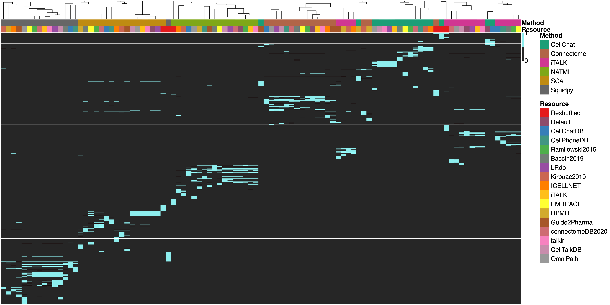

    grid::grid.newpage()

    get_BinaryHeat(top_lists$top_250)

    grid::grid.newpage()

    get_BinaryHeat(top_lists$top_1000)

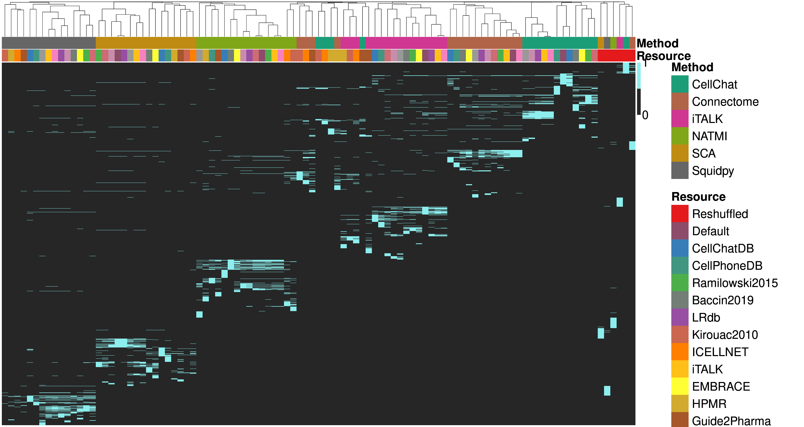

    grid::grid.newpage()

#### Number of Cell Types in the CRC dataset after filtering

    # Load Seurat and Check numbers from metadata
    get_cellnum("input/crc_data/crc_korean_form.rds")

    ## # A tibble: 18 x 2
    ##    Cell_subtype              cell_occur
    ##    <fct>                          <int>
    ##  1 CD19CD20 B                      2049
    ##  2 CD4 T cells                     3980
    ##  3 CD8 T cells                     4647
    ##  4 cDC                              353
    ##  5 CMS1                            1201
    ##  6 CMS2                           10771
    ##  7 CMS3                            5486
    ##  8 CMS4                              11
    ##  9 gamma delta T cells              219
    ## 10 IgA Plasma                       180
    ## 11 IgG Plasma                      1661
    ## 12 NK cells                         948
    ## 13 Pro-inflammatory                2325
    ## 14 Proliferating                    165
    ## 15 Regulatory T cells              2943
    ## 16 SPP1                            3096
    ## 17 T follicular helper cells        548
    ## 18 T helper 17 cells               1961

#### PCA by Interaction Rank Frequencies

i.e. Interaction ranks per Pairs of Cell types z-normalized

    spec_list %>%
        get_rank_frequencies() %>%
        plot_freq_pca()

### Supplementary Note 2

#### Protein Complex Contents

    # resources
    complex_resources <-  c("Baccin2019",
                            "CellChatDB",
                            "CellPhoneDB",
                            "ICELLNET",
                            "Default")

    # methods
    complex_list <- list("CellChat" =
                          methods::new("MethodSpecifics",
                                       method_name="CellChat",
                                       method_results = readRDS("output/crc_res/cellchat_results.rds"),
                                       method_scores=list(
                                           "prob"=FALSE
                                       )),
                      "Squidpy" =
                          methods::new("MethodSpecifics",
                                       method_name="Squidpy",
                                       method_results = readRDS("output/crc_res/squidpy_results.rds"),
                                       method_scores=list(
                                           "pvalue"=FALSE
                                       ))
                      )

    # keep only the complex resources
    complex_list$CellChat@method_results %<>% keep(names(.) %in% complex_resources)
    complex_list$Squidpy@method_results %<>% keep(names(.) %in% complex_resources[-5])

    # Get Significant hits for Squidpy and CellChat
    sig_list <- get_top_hits(complex_list,
                             n_ints=c(500))

    # Percentages of Complexes
    compl_perc <- sig_list$top_500 %>%
        enframe(name = "method") %>%
        unnest(value) %>%
        mutate(resource = names(value)) %>%
        unnest(value)

    cellchat_perc <- compl_perc %>%
        select(method, resource, ligand, receptor) %>%
        group_by(method, resource) %>%
        add_count(name = "total") %>%
        filter((str_detect(receptor, "_") | str_detect(ligand, "_"))) %>%
        add_count(name = "complex") %>%
        mutate(prop = complex/total) %>%
        select(resource, method, prop) %>%
        distinct()
    cellchat_perc

    ## # A tibble: 5 x 3
    ## # Groups:   method, resource [5]
    ##   resource    method     prop
    ##   <chr>       <chr>     <dbl>
    ## 1 Default     CellChat 0.23  
    ## 2 CellChatDB  CellChat 0.222 
    ## 3 CellPhoneDB CellChat 0.0778
    ## 4 Baccin2019  CellChat 0.068 
    ## 5 ICELLNET    CellChat 0.018

    squidpy_perc <- compl_perc %>%
        select(method, resource, uniprot_source, unprot_target) %>%
        na.omit() %>%
        group_by(method, resource) %>%
        add_count(name = "total") %>%
        filter((str_detect(uniprot_source, "COMPLEX:") | str_detect(unprot_target, "COMPLEX:"))) %>%
        add_count(name = "complex") %>%
        mutate(prop = complex/total) %>%
        select(resource, method, prop) %>%
        distinct()
    squidpy_perc

    ## # A tibble: 4 x 3
    ## # Groups:   method, resource [4]
    ##   resource    method    prop
    ##   <chr>       <chr>    <dbl>
    ## 1 CellChatDB  Squidpy 0.381 
    ## 2 CellPhoneDB Squidpy 0.16  
    ## 3 Baccin2019  Squidpy 0.126 
    ## 4 ICELLNET    Squidpy 0.0973

### Supplementary Note 3

#### Cluster Specificity and Method Dissimilarity

    # Load method results with non-specific cluster measures
    nonspec_list <- list("CellChat" =
                             methods::new("MethodSpecifics",
                                       method_name="CellChat",
                                       method_results = readRDS("output/crc_res/cellchat_results.rds"),
                                       method_scores=list(
                                           "prob"=TRUE
                                           )),
                          "Connectome" =
                          methods::new("MethodSpecifics",
                                       method_name="Connectome",
                                       method_results = readRDS("output/crc_res/conn_results.rds"),
                                       method_scores=list(
                                           "weight_norm"=TRUE
                                       )),
                          "NATMI" =
                          methods::new("MethodSpecifics",
                                       method_name="NATMI",
                                       method_results = readRDS("output/crc_res/natmi_results.rds"),
                                       method_scores=list(
                                           "edge_avg_expr"=TRUE
                                       )),
                          "Squidpy" =
                          methods::new("MethodSpecifics",
                                       method_name="Squidpy",
                                       method_results = readRDS("output/crc_res/squidpy_results.rds"),
                                       method_scores=list(
                                           "means"= TRUE
                                       ))
    )

    nonspec_top_list <- get_top_hits(nonspec_list,
                                  n_ints=c(500))

#### Cluster-unspecific measures plots

    # Interactions Overlap Binary Heatmap
    get_BinaryHeat(nonspec_top_list$top_500)

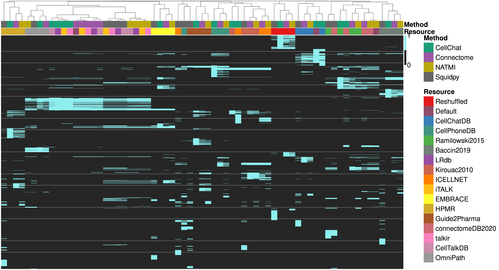

    grid::grid.newpage()

    # Activity per Cell Type Heatmap
    get_activecell(nonspec_top_list$top_500)

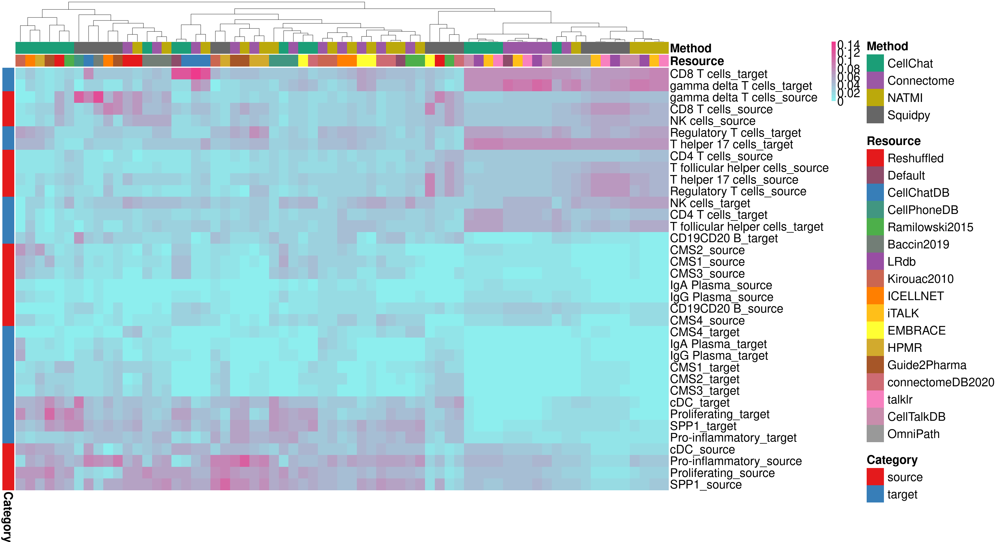

    grid::grid.newpage()

    # Jaccard Heatmap
    get_simdist_heatmap(nonspec_top_list$top_500,
                             sim_dist = "simil",
                             method = "Jaccard",
                             diag = TRUE,
                             upper = TRUE)

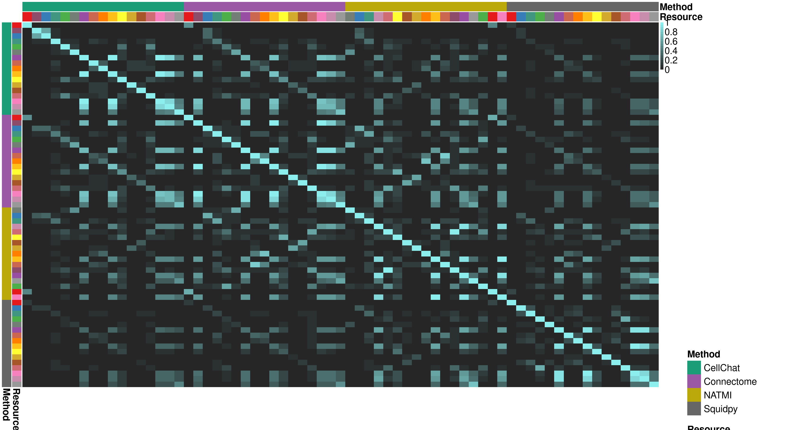

    grid::grid.newpage()

    # Jaccard Stats
    jaccard_nonspec <- simdist_resmet(nonspec_top_list$top_500,
                                     sim_dist = "simil",
                                     method = "Jaccard")
    # Mean Jacc Index per Method and Resource
    list_stats(meth = jaccard_nonspec$meth,
               reso = jaccard_nonspec$reso)

    ## # A tibble: 4 x 8
    ##   name      simdist        mn    med   len      sd   .min  .max
    ##   <glue>    <list>      <dbl>  <dbl> <int>   <dbl>  <dbl> <dbl>
    ## 1 meth_comb <dbl [420]> 0.118 0.0246   420 0.225   0      1    
    ## 2 reso_comb <dbl [90]>  0.404 0.376     90 0.206   0.0460 0.825
    ## 3 meth_mean <dbl [4]>   0.118 0.119      4 0.00331 0.113  0.120
    ## 4 reso_mean <dbl [15]>  0.404 0.375     15 0.110   0.277  0.618
