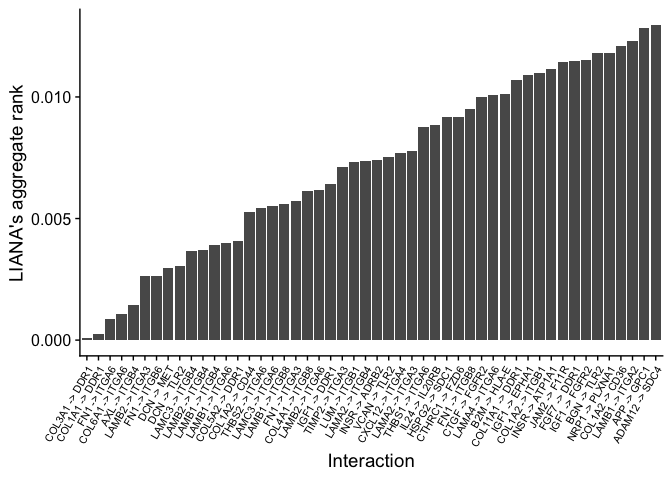
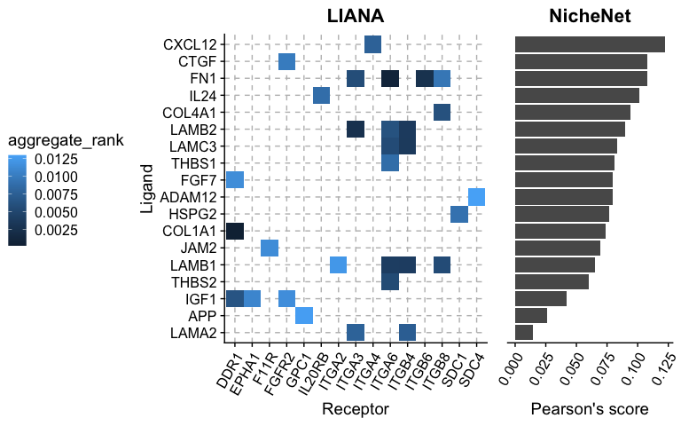

LIANA - NicheNet
================
Martin Garrido Rodriguez-Cordoba
2021-11-09

## Before you start

This vignette is an example of how to combine LIANA’s hypotheses with
those produced by NicheNet. The biological results that are obtained
here are highly dependent on the hypothesis in mind, which is described
in [NicheNet’s original
article](https://www.nature.com/articles/s41592-019-0667-5). Before you
start, we strongly recommend to have a look to the [NicheNet’s
repository](https://github.com/saeyslab/nichenetr), as the data and the
analyses that are run here were extracted from its vignettes. We
acknowledge NicheNet’s authors for the extensive and reproducible
documentation that they provide in this repository.

## Background

[LIANA](https://github.com/saezlab/liana/) (LIgand-receptor ANalysis
frAmework) is a framework able to prioritize ligand-receptor
interactions from single-cell transcriptomics using different resources
and methods. It allows users to systematically generate hypotheses about
which ligands from a given cell type is binding receptors on another. In
contrast to LIANA, NicheNet aims to deepen in the intra-cellular
mechanisms that connect a ligand with a set of transcriptional targets,
making an extensive usage of prior knowledge from multiple sources.
**LIANA and NicheNet are not mutually exclusive, but rather
complementary, given that they aim to explore different aspects of inter
and intra cellular communication**.


Because of this, in this vignette, we show how to use LIANA in
combination with NicheNet using the data and the biological scenario
described in [NicheNet’s
vignette](https://github.com/saeyslab/nichenetr/blob/master/vignettes/ligand_activity_geneset.md).
Briefly, the biological question here is: Which ligands expressed by
cancer-associated fibroblasts (CAFs) can induce a specific gene program
in neighboring malignant cells? (Using data from Puram et al. 2017).

## Load packages and data

We first load required libraries

``` r
library(tidyverse)
library(liana)
library(nichenetr)
library(Seurat)
library(ggrepel)
library(cowplot)
```

Then, we load and prepare the single-cell data, NicheNet’s model
weights, and the gene set of interest. The latest is composed by genes
that are known to participate in the partial epithelial-mesenchymal
transition (p-EMT) program, as defined in [NicheNet’s
vignette](https://github.com/saeyslab/nichenetr/blob/master/vignettes/ligand_activity_geneset.md).
Furthermore, we restrict the single-cell data to the two cell types of
interest for this example, which are the cancer associated fibroblasts
(CAFs) and the tumor cells.

``` r
# single-cell expression matrix described in Puram et al. 2017
hnscc_expression <-  readRDS(url("https://zenodo.org/record/3260758/files/hnscc_expression.rds"))
expression <- hnscc_expression$expression
sample_info <- hnscc_expression$sample_info 
colnames(sample_info) <- make.names(colnames(sample_info))

# filter samples based on vignette's information and add cell type
tumors_remove <-  c("HN10", "HN", "HN12", "HN13", "HN24", "HN7", "HN8", "HN23")
sample_info <- sample_info %>%
  subset( !(tumor %in% tumors_remove) & Lymph.node == 0) %>%
  # fix some cell type identity names
  mutate(cell_type = ifelse(classified..as.cancer.cell == 1, "Tumor", non.cancer.cell.type)) %>%
  subset(cell_type %in% c("Tumor", "CAF"))

# cell ID as rownames
rownames(sample_info) <- sample_info$cell

# subset expression to selected cells
expression <- expression[sample_info$cell, ]

# model weights
ligand_target_matrix <- readRDS(url("https://zenodo.org/record/3260758/files/ligand_target_matrix.rds"))

# gene set of interest
geneset_oi <- read_tsv(url("https://zenodo.org/record/3260758/files/pemt_signature.txt"), col_types = cols(), col_names = "gene") %>% 
  pull(gene) %>% 
  .[. %in% rownames(ligand_target_matrix)]
```

## Run LIANA

In the first step, we run LIANA to systematically score all the
ligand-receptor interactions between all the cell types included in the
dataset. To do so, we first need to create a Seurat object from data:

``` r
# create seurat object
seurat_object <- Seurat::CreateAssayObject(counts = expm1(t(expression))) %>%
  Seurat::CreateSeuratObject(., meta.data = sample_info) %>%
  Seurat::NormalizeData()

# set cell identity to cell type
Idents(seurat_object) <- seurat_object@meta.data$cell_type
```

And then we can execute LIANA using default parameters. After LIANA
execution, we employ the function `liana_aggregate()` to summarize the
output of different methods and to obtain a single score for each
interaction.

``` r
liana_results <- liana_wrap(seurat_object, method = c("connectome", "natmi", "sca", "cytotalk")) %>%
  liana_aggregate(.)
```

By default, LIANA will score the ligand-receptor interactions in all the
possible directions within the two cell types of interest. This
includes: Autocrine signaling (e.g. CAFs -&gt; CAFs), CAFs -&gt; Tumor
cells and Tumor cells -&gt; CAFs. As we are only interested in the CAFs
-&gt; Tumor cell direction, we filter the results and visualize the top
50 interactions according to the aggregate rank across methods.

``` r
# filter results to cell types of interest
caf_tumor_results <- liana_results %>%
  subset(source == "CAF" & target == "Tumor")

# filter results to top N interactions
n <- 50
top_n_caf_tumor <- caf_tumor_results %>%
  arrange(aggregate_rank) %>%
  slice_head(n = n) %>%
  mutate(id = fct_inorder(paste0(ligand, " -> ", receptor))) 

# visualize median rank
top_n_caf_tumor %>%
  ggplot(aes(y = aggregate_rank, x = id)) +
  geom_bar(stat = "identity") +
  xlab("Interaction") + ylab("LIANA's aggregate rank") +
  theme_cowplot() +
  theme(axis.text.x = element_text(size = 8, angle = 60, hjust = 1, vjust = 1))
```

<!-- -->

## Run NicheNet using LIANA’s ligands

The key aspect of combining LIANA with NicheNet is that we can use the
ligands prioritized by LIANA as the set of potential ligands for
NicheNet. Instead of evaluating all the expressed ligands for which the
receptor is also expressed in the receiver cell type, we will only
explore those that were prioritized by the methods included in LIANA.
Hence, we select the ligands that form the interactions previously
shown.

``` r
# get ligands and filter to those included in NicheNet's ligand-target matrix
ligands <- unique(top_n_caf_tumor$ligand)
ligands <- ligands[ligands %in% colnames(ligand_target_matrix)]
ligands
```

    ##  [1] "COL1A1" "FN1"    "LAMB2"  "LAMC3"  "LAMB1"  "THBS2"  "COL4A1" "IGF1"  
    ##  [9] "LAMA2"  "CXCL12" "THBS1"  "IL24"   "HSPG2"  "CTGF"   "JAM2"   "FGF7"  
    ## [17] "APP"    "ADAM12"

Before running NicheNet, we also need to define a list of background
genes. To do so, we employ the threshold defined in [NicheNet’s
vignette](https://github.com/saeyslab/nichenetr/blob/master/vignettes/ligand_activity_geneset.md).

``` r
background_genes <- expression[sample_info$cell[sample_info$cell_type == "Tumor"], ] %>%
  apply(2,function(x){10*(2**x - 1)}) %>% 
  apply(2,function(x){log2(mean(x) + 1)}) %>% 
  .[. >= 4] %>% 
  names()
```

And execute NicheNet to predict the ligand activities using the pEMT
gene set previously mentioned

``` r
nichenet_activities <- predict_ligand_activities(
  geneset = geneset_oi,
  background_expressed_genes = background_genes,
  ligand_target_matrix = ligand_target_matrix, potential_ligands = ligands
)
```

As a result, we obtain the NicheNet’s activity predictions for the
ligands previously prioritized using LIANA. In a final step, we will
visualize the ligand-receptor scores of LIANA and the ligand activity
score of NicheNet in a single figure.

``` r
# prepare data for visualization
vis_liana_nichenet <- top_n_caf_tumor %>%
  inner_join(nichenet_activities, by = c("ligand" = "test_ligand")) %>%
  arrange(pearson) %>%
  mutate(ligand = fct_inorder(ligand))

# prepare NicheNet figure
nichenet_scores_plot <- vis_liana_nichenet %>%
  group_by(ligand) %>%
  summarize(pearson = mean(pearson)) %>%
  ggplot(aes(y = ligand, x = pearson)) +
  geom_bar(stat = "identity") + 
  ggtitle("NicheNet") + 
  xlab("Pearson's score") +
  theme_cowplot() +
  theme(axis.text.y = element_blank(),
        axis.ticks.y = element_blank(),
        axis.title.y = element_blank(),
        axis.line.y = element_line(color = "white"),
        plot.title = element_text(hjust = 0.5),
        axis.text.x = element_text(angle = 60, hjust = 1, vjust = 1))

# prepare LIANA figure
liana_receptor_heatmap <- vis_liana_nichenet %>%
  ggplot(aes(y = ligand, x = receptor, fill = aggregate_rank)) +
  geom_tile() +
  theme_cowplot() +
  ggtitle("LIANA") +
  ylab("Ligand") + xlab("Receptor") +
  theme(axis.text.x = element_text(angle = 60, hjust = 1, vjust = 1),
        plot.title = element_text(hjust = 0.5),
        panel.grid.major = element_line(colour = "gray", linetype = 2),
        legend.position = "left")

# combine plots
plot_grid(liana_receptor_heatmap, nichenet_scores_plot, 
          align = "h", nrow = 1, rel_widths = c(0.8,0.3))
```

<!-- -->

## Conclusion

In this vignette, we exemplify how to use LIANA’s predictions as
NicheNet’s input. Although both methods are complementary, there is one
final point that should not be forgotten: LIANA predicts ligand-receptor
interaction pairs. However, NicheNet score for a given ligand comes from
how likely is to reach a set of given targets. A ligand can have a great
Pearson correlation score to regulate a given set of targets, but we do
not actually know if it is mediated by the receptor that we predicted
using LIANA. It could be that another receptor is the one mediating the
interaction with the ligand leading to the regulatory events controlling
the expression of the target genes.

## R Session information

``` r
sessionInfo()
```

    ## R version 4.1.1 (2021-08-10)
    ## Platform: x86_64-apple-darwin17.0 (64-bit)
    ## Running under: macOS Big Sur 10.16
    ## 
    ## Matrix products: default
    ## BLAS:   /Library/Frameworks/R.framework/Versions/4.1/Resources/lib/libRblas.0.dylib
    ## LAPACK: /Library/Frameworks/R.framework/Versions/4.1/Resources/lib/libRlapack.dylib
    ## 
    ## locale:
    ## [1] en_US.UTF-8/en_US.UTF-8/en_US.UTF-8/C/en_US.UTF-8/en_US.UTF-8
    ## 
    ## attached base packages:
    ## [1] stats     graphics  grDevices utils     datasets  methods   base     
    ## 
    ## other attached packages:
    ##  [1] cowplot_1.1.1      ggrepel_0.9.1      SeuratObject_4.0.2 Seurat_4.0.4      
    ##  [5] nichenetr_1.0.0    liana_0.0.3        forcats_0.5.1      stringr_1.4.0     
    ##  [9] dplyr_1.0.7        purrr_0.3.4        readr_2.0.2        tidyr_1.1.4       
    ## [13] tibble_3.1.5       ggplot2_3.3.5      tidyverse_1.3.1   
    ## 
    ## loaded via a namespace (and not attached):
    ##   [1] rappdirs_0.3.3              scattermore_0.7            
    ##   [3] ModelMetrics_1.2.2.2        bit64_4.0.5                
    ##   [5] knitr_1.36                  irlba_2.3.3                
    ##   [7] DelayedArray_0.18.0         data.table_1.14.2          
    ##   [9] rpart_4.1-15                RCurl_1.98-1.5             
    ##  [11] generics_0.1.0              BiocGenerics_0.38.0        
    ##  [13] ScaledMatrix_1.0.0          RANN_2.6.1                 
    ##  [15] proxy_0.4-26                future_1.22.1              
    ##  [17] DiagrammeR_1.0.6.1          bit_4.0.4                  
    ##  [19] tzdb_0.1.2                  spatstat.data_2.1-0        
    ##  [21] xml2_1.3.2                  lubridate_1.8.0            
    ##  [23] httpuv_1.6.3                SummarizedExperiment_1.22.0
    ##  [25] assertthat_0.2.1            viridis_0.6.1              
    ##  [27] gower_0.2.2                 xfun_0.26                  
    ##  [29] hms_1.1.1                   evaluate_0.14              
    ##  [31] promises_1.2.0.1            fansi_0.5.0                
    ##  [33] progress_1.2.2              caTools_1.18.2             
    ##  [35] dbplyr_2.1.1                readxl_1.3.1               
    ##  [37] igraph_1.2.6                DBI_1.1.1                  
    ##  [39] htmlwidgets_1.5.4           spatstat.geom_2.3-0        
    ##  [41] stats4_4.1.1                ellipsis_0.3.2             
    ##  [43] backports_1.2.1             deldir_1.0-5               
    ##  [45] sparseMatrixStats_1.4.2     MatrixGenerics_1.4.3       
    ##  [47] vctrs_0.3.8                 SingleCellExperiment_1.14.1
    ##  [49] Biobase_2.52.0              ROCR_1.0-11                
    ##  [51] entropy_1.3.1               abind_1.4-5                
    ##  [53] caret_6.0-90                withr_2.4.2                
    ##  [55] checkmate_2.0.0             vroom_1.5.5                
    ##  [57] sctransform_0.3.2           fdrtool_1.2.16             
    ##  [59] prettyunits_1.1.1           scran_1.20.1               
    ##  [61] goftest_1.2-3               cluster_2.1.2              
    ##  [63] lazyeval_0.2.2              crayon_1.4.1               
    ##  [65] labeling_0.4.2              edgeR_3.34.1               
    ##  [67] recipes_0.1.17              pkgconfig_2.0.3            
    ##  [69] GenomeInfoDb_1.28.4         vipor_0.4.5                
    ##  [71] nlme_3.1-153                nnet_7.3-16                
    ##  [73] rlang_0.4.11                globals_0.14.0             
    ##  [75] lifecycle_1.0.1             miniUI_0.1.1.1             
    ##  [77] modelr_0.1.8                rsvd_1.0.5                 
    ##  [79] cellranger_1.1.0            randomForest_4.6-14        
    ##  [81] polyclip_1.10-0             matrixStats_0.61.0         
    ##  [83] lmtest_0.9-38               Matrix_1.3-4               
    ##  [85] zoo_1.8-9                   beeswarm_0.4.0             
    ##  [87] reprex_2.0.1                base64enc_0.1-3            
    ##  [89] ggridges_0.5.3              png_0.1-7                  
    ##  [91] viridisLite_0.4.0           bitops_1.0-7               
    ##  [93] KernSmooth_2.23-20          visNetwork_2.1.0           
    ##  [95] pROC_1.18.0                 DelayedMatrixStats_1.14.3  
    ##  [97] parallelly_1.28.1           jpeg_0.1-9                 
    ##  [99] S4Vectors_0.30.2            beachmat_2.8.1             
    ## [101] scales_1.1.1                magrittr_2.0.1             
    ## [103] plyr_1.8.6                  ica_1.0-2                  
    ## [105] RobustRankAggreg_1.1        zlibbioc_1.38.0            
    ## [107] compiler_4.1.1              dqrng_0.3.0                
    ## [109] RColorBrewer_1.1-2          fitdistrplus_1.1-6         
    ## [111] cli_3.0.1                   XVector_0.32.0             
    ## [113] listenv_0.8.0               patchwork_1.1.1            
    ## [115] pbapply_1.5-0               htmlTable_2.3.0            
    ## [117] Formula_1.2-4               MASS_7.3-54                
    ## [119] mgcv_1.8-38                 tidyselect_1.1.1           
    ## [121] stringi_1.7.5               highr_0.9                  
    ## [123] yaml_2.2.1                  BiocSingular_1.8.1         
    ## [125] locfit_1.5-9.4              latticeExtra_0.6-29        
    ## [127] grid_4.1.1                  tools_4.1.1                
    ## [129] future.apply_1.8.1          parallel_4.1.1             
    ## [131] rstudioapi_0.13             bluster_1.2.1              
    ## [133] foreach_1.5.1               foreign_0.8-81             
    ## [135] metapod_1.0.0               gridExtra_2.3              
    ## [137] prodlim_2019.11.13          farver_2.1.0               
    ## [139] Rtsne_0.15                  digest_0.6.28              
    ## [141] shiny_1.7.1                 lava_1.6.10                
    ## [143] Rcpp_1.0.7                  GenomicRanges_1.44.0       
    ## [145] broom_0.7.9                 scuttle_1.2.1              
    ## [147] later_1.3.0                 RcppAnnoy_0.0.19           
    ## [149] httr_1.4.2                  colorspace_2.0-2           
    ## [151] rvest_1.0.1                 fs_1.5.0                   
    ## [153] tensor_1.5                  reticulate_1.22            
    ## [155] IRanges_2.26.0              splines_4.1.1              
    ## [157] uwot_0.1.10                 statmod_1.4.36             
    ## [159] OmnipathR_3.0.4             spatstat.utils_2.2-0       
    ## [161] scater_1.18.6               plotly_4.10.0              
    ## [163] xtable_1.8-4                jsonlite_1.7.2             
    ## [165] timeDate_3043.102           ipred_0.9-12               
    ## [167] R6_2.5.1                    Hmisc_4.6-0                
    ## [169] pillar_1.6.3                htmltools_0.5.2            
    ## [171] mime_0.12                   glue_1.4.2                 
    ## [173] fastmap_1.1.0               BiocParallel_1.26.2        
    ## [175] BiocNeighbors_1.10.0        class_7.3-19               
    ## [177] codetools_0.2-18            utf8_1.2.2                 
    ## [179] lattice_0.20-45             spatstat.sparse_2.0-0      
    ## [181] logger_0.2.1                curl_4.3.2                 
    ## [183] ggbeeswarm_0.6.0            leiden_0.3.9               
    ## [185] survival_3.2-13             limma_3.48.3               
    ## [187] rmarkdown_2.11              munsell_0.5.0              
    ## [189] e1071_1.7-9                 GenomeInfoDbData_1.2.6     
    ## [191] iterators_1.0.13            haven_2.4.3                
    ## [193] reshape2_1.4.4              gtable_0.3.0               
    ## [195] spatstat.core_2.3-0
