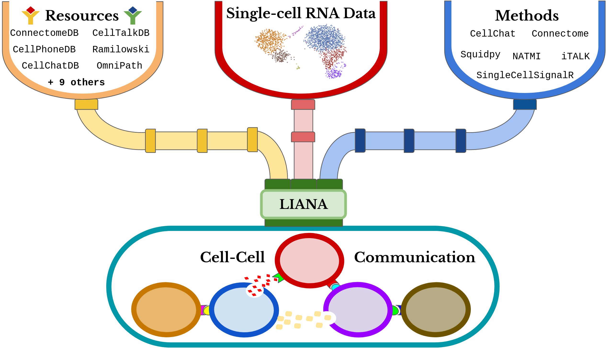

```{r chunk_setup, include = FALSE}
knitr::opts_chunk$set(
    collapse = TRUE,
    comment = "#>"
)
```

# `liana`: Intro

The continuous developments of single-cell RNA-Seq (scRNA-Seq) have sparked an
immense interest in understanding intercellular crosstalk. Multiple tools and
resources that aid the investigation of cell-cell communication (CCC) were 
published recently. However, these methods and resources are usually in a fixed
combination of a tool and its corresponding resource, but in principle any
resource could be combined with any method.

To this end, we built `liana` - a framework to decouple the tools from their
corresponding resources.



## Load required packages
```{r load_pkgs, message=FALSE, warning=FALSE}
require(tidyverse)
require(magrittr)
require(liana)
```

## CCC Resources
`liana` provides CCC resources obtained and formatted via [`OmnipathR`](https://github.com/saezlab/OmnipathR) which are then converted to the appropriate format to each method.
```{r liana_resource, warning = FALSE}
# Resource currently included in OmniPathR (and hence `liana`) include:
show_resources()

# A list of resources can be obtained using the `select_resource()` function:
# See `?select_resource()` documentation for further information.
# select_resource(c('OmniPath')) %>% glimpse() 
```
  
  
## CCC Methods
Each of the resources can then be run with any of the following methods:
```{r liana_method, warning = FALSE}
# Resource currently included in OmniPathR (and hence `liana`) include:
show_methods()
```
Note that the different algorithms (or scoring measures) used in `sca`, `natmi`,
`connectome`, `cellphonedb`, `cytotalk`'s crosstalk scores, and `logfc` were re-implemented in LIANA.
Yet, the original method pipelines can be called via the `call_*` functions.

## `liana` wrapper function

To run `liana`, we will use a toy PBMCs scRNA-Seq data set, obtained from [SeuratData](https://github.com/satijalab/seurat-data).

`liana` takes `Seurat` and `SingleCellExperiment` objects as input, containing processed counts and clustered cells
```{r load_data}
liana_path <- system.file(package = "liana")
testdata <-
  readRDS(file.path(liana_path , "testdata", "input", "testdata.rds"))

testdata %>% glimpse()
```

`liana_wrap` calls a number of methods and and each method is run with the provided resource(s).

We will now call all methods that are currently available in liana.

Here we use only the "OmniPath" CCC resource, but any of the 
aforementioned ones (available via `show_resources()`) can be added to the `resource` parameter
```{r liana_run, message = FALSE, print = FALSE, results='hide'}
# Run liana
liana_test <- liana_wrap(testdata)

# Liana returns a list of results, each element of which corresponds to a method
liana_test %>% glimpse
```
LIANA currently provides a mixture of re-implemented methods and pipelines which externally call specific LR methods.
By default, LIANA will call only the internal scoring function (or those that are re-implemented in LIANA).

However, one can use LIANA to also run the original methods.
For more information and validation with the original methods see [LIANA++](https://saezlab.github.io/liana/articles/liana_devel.html) and [validate scores](https://saezlab.github.io/liana/articles/liana_remethod.html), respectively.


## Aggregate and Obiain Consensus Ranks
`liana` also provides consensus ranks for the results obtained using different
methods. By default, `liana` will provide mean, median, and aggregate* consensus
ranks
```{r liana_ranks, warning=FALSE}
# We can aggregate these results into a tibble with consensus ranks
liana_test <- liana_test %>%
  liana_aggregate()

glimpse(liana_test)
```

Voila! That's it. A very brief intro to LIANA and how to obtain the scoring functions†
for each method implemented in it, as well as an aggregate_rank* which serves as a consensus across methods.

(†) Note that here we focus on the scores recommended to be used to prioritize interaction in a 
single sample system. Most of these, with the exception of SingleCellSignalR's LRscore, take
the specificity of the cluster pair into account.

(*) The aggregate consensus rank (`aggregate_rank`) is obtained using the RobustRankAggreg package and its [`RRA`](https://www.ncbi.nlm.nih.gov/pmc/articles/PMC3278763/) method.

`RRA` scores can be interpreted as p-values and interactions which are
ranked consistently higher than random are assigned low scores/p-values.

## Simple DotPlot

We will now plot the results. By default, we use the `LRscore` from SingleCellSignalR
to represent the magnitude of expression of the ligand and receptor, and NATMI's `specificity weights`
to show how specific a given interaction is to the `source`(L) and `target`(R) cell types.

In this case, we plot the top 25 interactions with the lowest aggregate_rank scores, 
and we plot interactions in which B cells are the `source` (express the ~ligands) and
the other 3 cell types in this toy dataset are the `target` (express the ~receptors).
```{r liana_dotplot, warning=FALSE, fig.width=11, fig.height=8}
liana_test %>% 
  filter(source =="B") %>%
  top_n(25, desc(aggregate_rank)) %>%
  liana_dotplot(source_groups = c("B"),
                target_groups = c("NK", "CD8 T", "B"))
```
Note that missing dots are interactions which are not expressed in at least 10% of the cells (by default)
in both cell clusters.


## Run any method of choice.

We will now run only the CellPhoneDB's permutation-based algorithm.
We will also lower the number of permutations that we wish to perform for the sake of computational time.
Note that one can also parallelize the CPDB algorithm implemented in LIANA (in this case we don't,
as this would only make sense when working with large datasets).

Also, here we will use a `SingleCellExperiment` object as input. In reality, LIANA converts `Seurat` objects
to SingleCellExperiment and is to a large extend based on the BioConductor single-cell infrastructure.

Finally, in this scenario we decide to show the names of the complexes, rather than the subunit with the lowest ~expression.
```{r cpdb_test, message = FALSE, print = FALSE, warning=FALSE, fig.width=11, fig.height=8}
# Load Sce testdata
sce <- readRDS(file.path(liana_path , "testdata", "input", "testsce.rds"))

# RUN CPDB alone
cpdb_test <- liana_wrap(sce,
                        method = 'cellphonedb',
                        resource = c('CellPhoneDB'),
                        permutation.params = list(nperms=100,
                                                  parallelize=FALSE,
                                                  workers=4))

# Plot toy results
cpdb_test %>%
  # filter(pvalue <= 0.05) %>% # only keep interactions with p-val <= 0.05
  mutate(pvalue = -log10(pvalue)) %>% # invert size (low p-value/high specificity = larger dot size)
  liana_dotplot(source_groups = c("c"),
                target_groups = c("c", "a", "b"),
                specificity = "pvalue",
                magnitude = "lr.mean",
                show_complex = TRUE)
```


## SingleCellSignalR, CytoTalk, NATMI, and Connectome scores /w Complexes
The re-implementation of the aforementioned methods in LIANA enables us to make use of 
multimeric complex information as provided by the e.g. CellPhoneDB, CellChatDB, and ICELLNET resources

```{r complex_test, message = FALSE, print = FALSE}
# Run liana re-implementations with the CellPhoneDB resource
complex_test <- liana_wrap(testdata,
                           method = c('natmi', 'sca', 'logfc'),
                           resource = c('CellPhoneDB'))

complex_test %>% liana_aggregate()
```


## Call `liana` with overwritten default settings
By default `liana` is run with the default for each method which can be obtained via `liana_default()`

Alternatively, one can also overwrite the default settings by simply passing them to the liana wrapper function
```{r liana_params, message = FALSE, print = FALSE}
geometric_mean <- function(vec){exp(mean(log(vec)))}

# Overwrite CellChat default parameters by providing a list of parameters
liana_test <- liana_wrap(testdata,
                         method = c('cellphonedb', 'sca'),
                         resource = 'OmniPath',
                         permutation.params = 
                           list(
                             nperms = 10 # here we run cpdb it only with 10 permutations
                             ),
                         liana_call.params=list(complex_policy = "mean")
                         )

# This returns a list of results for each method
liana_test %>% glimpse
```
Note that with `liana_call.params` one can change the way that we account for complexes.
By default this is set to the mean of the subunits in the complex (as done for expression in CellPhoneDB/Squidpy), 
and it would return the subunit closest to the mean. 

Here we change it to the geometric_mean, but any alternative function can be passed and other 
perfectly viable approaches could also include e.g. the Trimean of CellChat.
  
Please refer to the `?liana_wrap` documentation for more information on all the parameters that can be tuned in liana.
Also, one can obtain a list with all default parameters by calling the `liana_defaults()` function.
  
  
###### Information about the parameters passed to each method can be obtained via `liana_call` and via
`call_*` functions - e.g. ?call_cellchat or ?call_squidpy.
A list with the default parameters themselves can be obtained via `liana_defaults()`


## Citation
```{r liana citation, message = FALSE, echo=FALSE}
citation("liana")
```


## Session information
```{r session_info, echo=FALSE}
options(width = 120)
sessioninfo::session_info()
```

